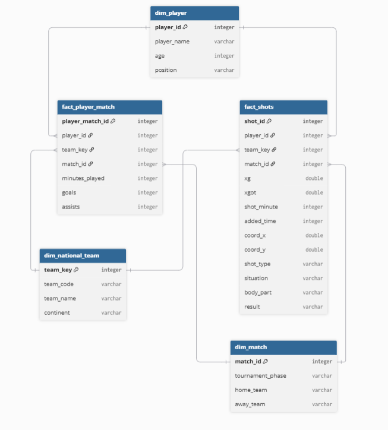
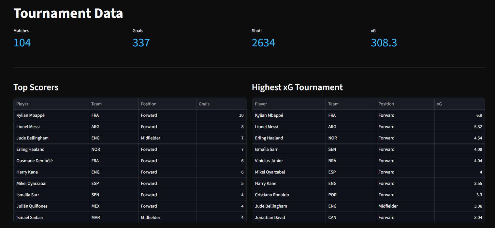
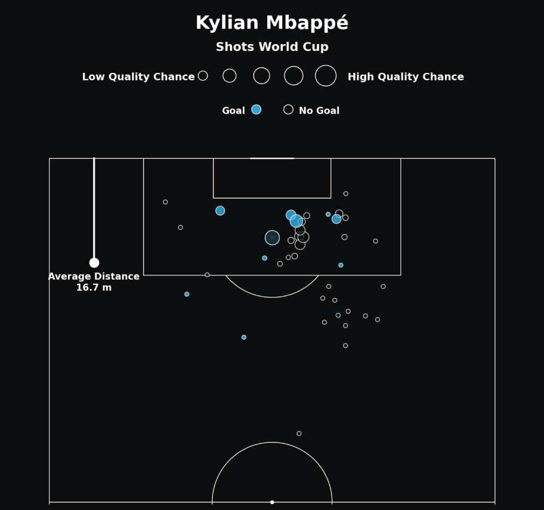
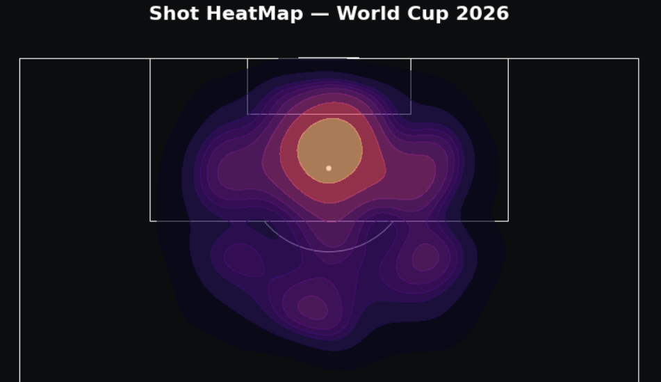

# World Cup Data Engineering & Analytics

[](https://www.python.org/)
[](https://spark.apache.org/)
[](https://pandas.pydata.org/)
[](https://streamlit.io/)
[](https://parquet.apache.org/)
[](https://mplsoccer.readthedocs.io/)


## Visão Geral

Este projeto é sobre engenharia de dados ponta a ponta desenvolvida sobre os dados de eventos da Copa do Mundo.

O objetivo principal é transformar dados brutos de partidas e finalizações em uma camada dimensional refinada (*Star Schema*), alimentando um dashboard analítico interativo focado em **métricas avançadas de futebol** (xG, xGOT, taxa de conversão e overperformance +/-).


## Arquitetura de Dados (Medallion Architecture)

O pipeline foi estruturado seguindo os princípios de arquitetura de dados em camadas (Data Lakehouse):

```
┌─────────────────┐       ┌─────────────────┐       ┌─────────────────┐       ┌─────────────────┐
│   RAW LAYER     │  ───► │  TRUSTED LAYER  │  ───► │  REFINED LAYER  │  ───► │ ANALYTICS & APP │
│ (Scraping/CSV)  │       │ (PySpark Clean) │       │  (Star Schema)  │       │   (Streamlit)   │
└─────────────────┘       └─────────────────┘       └─────────────────┘       └─────────────────┘
```

1. **Camada Raw (`data/raw`):** Extração de dados brutos de eventos, partidas, escalações e idades dos atletas via scripts de web scraping e consumo de APIs esportivas.
2. **Camada de Referência (`data/reference` / `src/reference`):** Dados de referência, nomes oficiais dos países e seus respectivos continentes.
3. **Camada Trusted (`data/trusted`):** Higienização, tipagem estrita, deduplicação e validação de regras de negócio (coordenadas de campo e valores nulos) utilizando **Apache Spark (PySpark)**.
4. **Camada Refined (`data/refined`):** Modelagem dimensional estruturada em formato colunar de alta performance (**Apache Parquet**), particionada entre Tabelas Fato e Dimensões.
5. **Camada de Aplicação (`app/`):** Dashboard analítico construído em **Streamlit** com visualizações táticas utilizando **mplsoccer** e **Matplotlib**.


## Modelagem Dimensional (Star Schema)

A camada analítica foi projetada no modelo **Star Schema** para otimizar agregações, simplificar consultas analíticas e garantir consistência entre entidades:

<p align="center">
  
</p>

### Dicionário de Tabelas

| Tabela | Tipo | Descrição |
|---|---|---|
| `fact_shots` | **Fato** | Granularidade por finalização (chute). Contém coordenadas $(X, Y)$, minuto, acréscimos, $xG$, $xGOT$, tipo de finalização, situação e resultado. |
| `fact_player_match` | **Fato** | Granularidade por atleta/partida. Registra minutos jogados, gols e assistências por jogo. |
| `dim_player` | **Dimensão** | Dados cadastrais do jogador (nome, posição e idade). |
| `dim_match` | **Dimensão** | Dados da partida (data, fase do torneio, times mandante e visitante). |
| `dim_national_teams` | **Dimensão** | Informações da seleção nacional (código FIFA, nome e continente). |
---

## Painel Analítico & Visualizações

O aplicativo interativo em **Streamlit** é dividido em duas seções principais:

### 1. Tournament Data (Visão Geral do Torneio)
- **KPIs Globais:** Total de partidas, gols, finalizações e volume de xG.
- **Tabelas de Destaque:** *Top Scorers* e *Highest xG* enriquecidos com seleção e posição.
- **Player Performance:** Tabela analítica completa com métricas de volume, xG/chute e +/- (Goals - xG).
- **Team Efficiency:** Ranking de seleções por overperformance em relação ao modelo preditivo.
- **Taxa de Conversão por Continente & Situação:** Análise de eficácia em bola parada, jogada aberta e pênaltis.
- **Gols, xG & xGOT por Seleção:** Gráfico comparativo triplo das 16 principais seleções.
- **Análise Temporal com Acréscimos:** Distribuição de chutes e taxa de conversão por faixas de minutos, tratando especificamente os períodos de acréscimo (45+ e 90+).
- **Tournament Shot Heatmap:** Mapa de densidade de chutes do campeonato em campo oficial.

<p align="center">
  
</p>

### 2. Shot Map by Player (Mapa de Chutes Individual)
- Seleção dinâmica de atletas.
- Mapa de finalizações com sistema de coordenadas **Opta**.
- Marcadores proporcionais à qualidade da chance (xG).
- Indicador visual de distância média das finalizações em metros.

<p align="center">
  
</p>

### 3. Tournament Shot Heat Map (Mapa de Calor do Torneio)
- Visualização espacial de densidade de finalizações via Kernel Density Estimation (KDE).
- Sistema de coordenadas verticais **Opta** com enquadramento de meio-campo ofensivo.
- Identificação visual das zonas de maior volume e perigo de finalização ao longo de toda a Copa do Mundo.

<p align="center">
  
</p>

## Estrutura do Repositório

```text
├── app/                       
│   ├── app.py                  
│   ├── data_loader.py       
│   ├── shot_map.py           
│   └── heat_map.py
├── assets/
│   └── imgs/               
├── data/
│   ├── raw/                   
│   ├── reference/             
│   ├── trusted/               
│   └── refined/                            
├── notebooks/                 
│   ├── shot_map.ipynb
│   └── heap_map.ipynb
└── src/                        
    ├── extract/               
    ├── reference/             
    ├── trusted/               
    └── refined/            
```

## Como Executar o Projeto

### Pré-requisitos
- **Python 3.10+** instalado.
- *(Opcional)* Java 11 e Hadoop configurados caso queira reexecutar os jobs PySpark na pasta `src/`.

### 1. Clonar o Repositório
```bash
git clone https://github.com/SEU_USUARIO/worldCupData.git
cd worldCupData
```

### 2. Instalar Dependências
```bash
pip install -r requirements.txt
```

### 3. Executar o Dashboard
```bash
streamlit run app/app.py
```

## Tech Stack

- **Linguagem Principal:** Python
- **Processamento:** Apache Spark (PySpark)
- **Armazenamento Colunar:** Apache Parquet / PyArrow Dataset
- **Dashboard & Front-end:** Streamlit
- **Visualização de Dados:** Matplotlib & mplsoccer

## Autor

Desenvolvido por **Marlon Weber Filho**  
- LinkedIn: [linkedin.com/in/marlonweberfilho](www.linkedin.com/in/marlon-weber-filho-689861232)
- GitHub: [@MarlonWeber1](https://github.com/MarlonWeber1)
